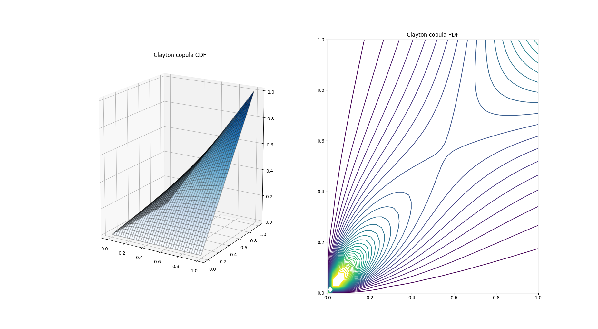
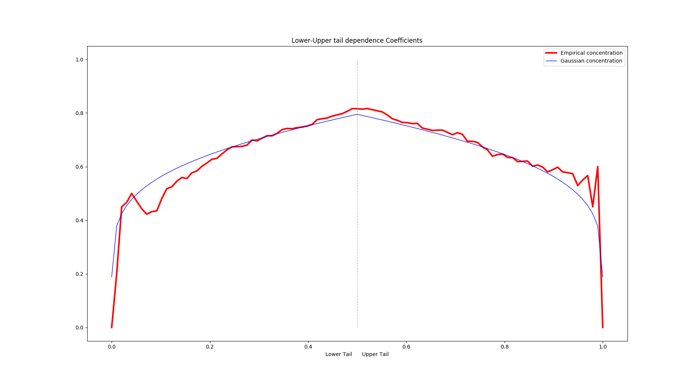
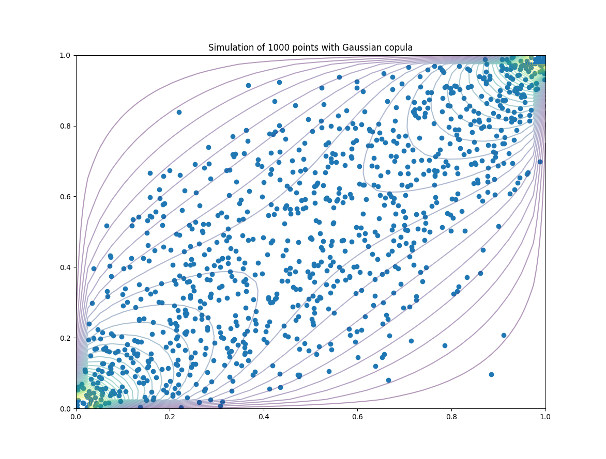

[](https://travis-ci.org/MaximeJumelle/PyCopula)

# PyCopula - Dependencies with copulas
PyCopula is an easy-to-use Python library that allows you to study random variables dependencies with copulas. It comes with useful tools and features to plot, estimate or simulate on copulas.

* [Online Documentation](https://aipcloud.github.io/PyCopula/)

## Features
PyCopula natively handle various families of copulas including :
- Archimean Copulas
	- Clayton
	- Gumbel
	- Joe
	- Frank
	- Ali-Mikhail-Haq
- Elliptic Copulas
	- Gaussien
	- Student

### Estimation
Three methods of estimation, based on *SciPy* numerical optimization routines, are available to provide high flexibility during fitting process.
- MLE : Maximum Likelihood Estimation
- IFM : Inference For Margins
- CMLE : Canonical Maximum Likelihood Estimation

## Usage
PyCopula was designed to provide an easy-to-use interface that does not require a lot in both programming and computing. As a result, only a few lines are needed to properly fit any copulas, as demonstrated in the following code snippet.
```python
import pandas as pd
from pycopula.copula import ArchimedeanCopula

data = pd.read_csv("data/classic.csv").values[:,1:]

archimedean = ArchimedeanCopula(family="gumbel", dim=2)
archimedean.fit(data, method="cmle")
```
```console
Archimedean Copula (gumbel) :
*	Parameter : 1.605037
```

## Visualization

#### 3D PDF and CDF



#### Concentration Functions



#### Estimation

#### Simulation



## Development

Currently, there are only a few features implemented in the library, which are the basics components for copula handling :

- Creating Archimedean, Gaussian and Student copulas
- 3D plot of PDF and CDF
- Concentration functions and visualization
- Estimation of copulas parameters (CMLE, MLE, IFM)

In the future, I plan to release the following features :

- Goodness-of-fit
- Copula selection with criterions and statistical testing
- Examples of applications in real world with open data

Also, if you are interested in the project, I would be happy to collaborate with you since there are still quite a lot of improvements needed (computation, estimation methods, visualization) and that I don't have enough time on my hands to do it quickly.


